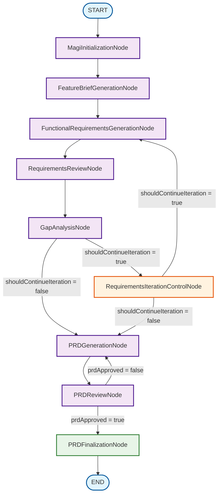

# PRD Generation Workflow Diagram

## Workflow Description

### **Linear Flow (Initial Pass):**

1. **MagiInitializationNode** - Initialize workflow environment
2. **FeatureBriefGenerationNode** - Generate feature brief from user input
3. **FunctionalRequirementsGenerationNode** - Generate initial functional requirements
4. **RequirementsReviewNode** - Present requirements for user review/approval
5. **GapAnalysisNode** - Analyze requirements for gaps and completeness

### **Iteration Loop (Requirements Refinement):**

- **RequirementsIterationControlNode** - Determines if iteration should continue
- **Loop Back to FunctionalRequirementsGenerationNode** - Generate additional requirements based on gaps
- **Continue through RequirementsReviewNode and GapAnalysisNode** - Review and analyze updated requirements
- **Repeat until no gaps or user chooses to stop**

### **PRD Generation and Review:**

6. **PRDGenerationNode** - Generate comprehensive PRD.md document
7. **PRDReviewNode** - Present PRD for user review/approval
8. **Loop Back to PRDGenerationNode** - If modifications are needed
9. **PRDFinalizationNode** - Finalize PRD and complete workflow

### **Key Decision Points:**

- **Gap Analysis Decision**: Continue iteration or proceed to PRD generation
- **Iteration Control Decision**: Continue requirements refinement or proceed to PRD generation
- **PRD Review Decision**: Approve PRD or request modifications

### **Terminal Node:**

- **PRDFinalizationNode**: Updates PRD status to "finalized" and marks workflow complete
