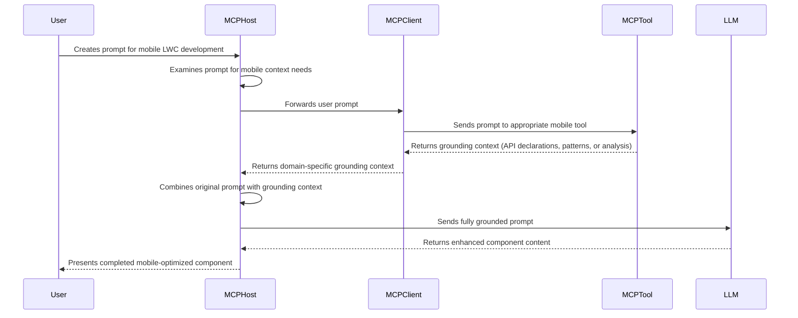

# `@salesforce/mobile-web-mcp-server` \- Project Design

# Overview

The `@salesforce/mobile-web-mcp-server` is the flagship MCP server within the `mobile-mcp-tools` monorepo, designed to provide comprehensive tooling support for Salesforce Mobile Web development scenarios. This server hosts multiple tool suites, each targeting specific mobile web development use cases.

The server is architected to be extensible, allowing for the addition of new tool suites as mobile web development needs evolve within the Salesforce ecosystem.

---

# High-Level Project Design

* The `@salesforce/mobile-web-mcp-server` MCP server exposes tools that provide additional expert grounding to user prompts crafted to create Lightning web components for mobile web scenarios.
* The grounding context provided by each server tool varies by tool suite—some tools provide TypeScript declaration content, others provide design patterns, best practices documentation, or other relevant guidance specific to their functional domain.
* The provided grounding context is _entirely static and public in nature_. There is _no_ user-specific or authenticated context required by these MCP tools. Their job is to simply provide the appropriate guidance to the original request, which significantly increases the accuracy of the generated components.

## Key Design Principles

### Tool Types and Capabilities

The server hosts different types of MCP tools depending on their functional domain:

**Information-Only Tools** (e.g., Native Capabilities)

- Supply grounding context to requesting MCP clients
- Expose TypeScript types and APIs available to the client
- Enable informed code completion, validation, and discovery of mobile capabilities

**Analysis and Guidance Tools** (e.g., Mobile Offline)

- Provide code review and refactoring guidance
- Support both purely agentic and static analysis approaches:
  - _Purely agentic_: Provide instructions on anti-patterns to detect and refactoring strategies, with no input required
  - _Static analysis + agentic refactor_: Accept LWC component code as input, run ESLint static analysis rules to detect offline anti-patterns, and return detailed reviews with refactoring instructions

### Modular Tool Organization

Tools are organized into logical suites based on functional domains:

- **Mobile Native Capabilities** - Tools for integrating device capabilities, sourced from `@salesforce/lightning-types`
- **Mobile Offline** - Tools for implementing offline-first design patterns, sourced from documentation and best practices
- **Future Tool Suites** - Extensible architecture supports additional mobile web development scenarios with appropriate source materials

### Consistent Naming Convention

To ensure clear differentiation from other Salesforce MCP server tools while maintaining concise names for MCP client compatibility, all tools use the `sfmobile-web-{capability}` naming pattern:

- Native capabilities: `sfmobile-web-{capability}` (e.g., `sfmobile-web-barcode-scanner`)
- Mobile offline: `sfmobile-web-offline-{analysis-type}` (two orchestrated tools: `sfmobile-web-offline-guidance` and `sfmobile-web-offline-analysis`)

This approach balances tool discoverability with practical MCP client limitations, while optimizing for an MCP host's capacity for just-in-time inclusion of tools for specific use cases.

---

# System Flow

The following sequence diagram shows the general flow between the user, MCP host (such as A4D or other community MCP hosts), and `@salesforce/mobile-web-mcp-server` MCP tools. This example models a typical interaction pattern that applies to both Information-Only tools (like Native Capabilities) and Analysis and Guidance tools (like Mobile Offline), with each tool suite providing its own domain-specific grounding context.



**Tool Suite Variations:**

- **Native Capabilities tools** return TypeScript API declarations for specific device capabilities
- **Mobile Offline tools** return discrete violation detection instructions (agentic) and comprehensive analysis reviews (static) with specific remediation guidance
- **Future tool suites** will follow this same pattern with their own domain-specific grounding materials

---

# MCP Client Integration and Transport

The server is designed for maximum compatibility across the MCP ecosystem by adhering to established Model Context Protocol standards:

* **npx Invocation:** The project is designed to be easily targeted and invoked by any MCP client using the standardized `npx` approach. For example, clients can launch the server with a command such as:

```
npx -y @salesforce/mobile-web-mcp-server
```

This ensures a frictionless, installation-free experience for developers and tools integrating with the MCP server, regardless of their chosen MCP host.

* **StdioServerTransport Communication:** Communication between the MCP server and clients uses the `stdio` transport mechanism, as described in the [Model Context Protocol documentation](https://modelcontextprotocol.io/docs/concepts/transports). This transport leverages standard input/output streams and is the recommended approach for command-line and local tool scenarios, ensuring broad compatibility across MCP implementations.

---

# MCP Server Properties

## Server Metadata

**Name:** `sfdc-mobile-web-mcp-server`  
**Description:** The `sfdc-mobile-web-mcp-server` MCP server provides a comprehensive collection of tools that enable developers to create Lightning web components (LWCs) for mobile web scenarios. Tool suites provide expert grounding through various sources including TypeScript declaration files, design patterns, best practices documentation, and other relevant materials specific to each functional domain.

## Common Server Tool Annotations

_See [Tool Annotations](https://modelcontextprotocol.io/docs/concepts/tools#tool-annotations) in the Model Context Protocol User Guide_

All tools include a `title` annotation using the human-readable title specified in their respective tool suite documentation. The following additional server tool annotations are applied based on tool type:

**Information-Only Tools (e.g., Native Capabilities):**

| Annotation        | Value   | Notes                                                                                        |
| :---------------- | :------ | :------------------------------------------------------------------------------------------- |
| `readOnlyHint`    | `true`  | Static content does not modify its environment, and returns the same value for each request. |
| `destructiveHint` | `false` | No modifications occur as part of these tools.                                               |
| `idempotentHint`  | `true`  | No changes from calling these tools repeatedly.                                              |
| `openWorldHint`   | `false` | These tools have no requirement to interact with external entities.                          |

**Analysis and Guidance Tools (e.g., Mobile Offline):**

| Annotation        | Value   | Notes                                                                                               |
| :---------------- | :------ | :-------------------------------------------------------------------------------------------------- |
| `readOnlyHint`    | `true`  | Tools analyze input without modifying it, returning consistent analysis results for the same input. |
| `destructiveHint` | `false` | No modifications occur, but analysis is performed on provided code.                                 |
| `idempotentHint`  | `true`  | Same input will produce consistent analysis results.                                                |
| `openWorldHint`   | `false` | These tools operate on provided input without external dependencies.                                |

---

# Technical Implementation

This section outlines the technical design and implementation details for the `@salesforce/mobile-web-mcp-server (mobile-web/)` project, which exists as a sub-project within the `mobile-mcp-tools` monorepo.

## Project Structure

The project follows a standard Node.js/TypeScript project structure:

```
mobile-web/
├── src/           # Source code for the MCP server implementation
│   ├── tools/     # Core tool implementations for server mode
│   ├── provider-tools/  # MCP provider tool adapters for integration mode
│   └── provider.ts      # MobileWebMcpProvider implementation
├── dist/          # Compiled JavaScript output
├── scripts/       # Project utilities and maintenance scripts
├── resources/     # TypeScript declaration files and tool suite resources
├── tests/         # Test files
└── package.json   # Project configuration and dependencies
```

## Tool Suite Organization

Each tool suite within the server has its own organized structure:

### Native Capabilities Suite

- **Focus:** Mobile device capabilities (barcode, location, contacts, etc.)
- **Source:** TypeScript declarations from `@salesforce/lightning-types` mobile capabilities stored in `resources/`
- **Tools:** Individual tools for each native capability providing API grounding context

### Offline Suite

- **Focus:** Discrete offline violation detection and remediation through complementary analysis approaches
- **Source:** Embedded analysis rules and guidance patterns (no external resource files needed for agentic tool), ESLint plugin for static analysis
- **Tools:** Two orchestrated tools (`sfmobile-web-offline-guidance` and `sfmobile-web-offline-analysis`) providing comprehensive coverage of all offline violation categories

## Development Environment

### TypeScript Configuration

The project is configured as a TypeScript project with the following key characteristics:

* Uses CommonJS as the module system
* Configured with "NodeNext" module resolution
* Inherits base TypeScript configuration from the umbrella project's `tsconfig.base.json`
* Strict type checking enabled

### Code Quality Tools

The project implements several tools to ensure code quality and consistency:

* **Prettier:** Configured for consistent code formatting
* **ESLint:** Implements standard TypeScript linting rules
* **Husky:** Enforces pre-commit hooks to prevent commits with formatting or linting issues

### Testing Infrastructure

The project uses **Vitest** for its testing framework, providing:

* Unit testing capabilities
* Integration testing for MCP host/client interactions
* Test coverage reporting

## Resource Management

The project uses a `resources/` directory to house non-functional resources such as documentation, guides, API declarations, and other materials that support the various tool suites. Each tool suite manages its resource requirements according to its specific needs and source materials.

## Integration with Umbrella Project

As part of the `mobile-mcp-tools` monorepo:

* Shares common configuration through the umbrella project
* Follows consistent coding standards and practices
* Participates in the monorepo's build and test pipelines

---

# Security Requirements and Considerations

This project follows established security best practices for MCP servers and AI-assisted development tools. The design prioritizes security through simplicity and adherence to the information-only pattern established in the Model Context Protocol ecosystem.

## Security Profile

| **Security Consideration**      | **Status** | **Notes**                                                     |
| :------------------------------ | :--------- | :------------------------------------------------------------ |
| **Sensitive Content**           | None       | All provided content is public API documentation and guidance |
| **Dynamic Content**             | No         | Tools provide static grounding context only                   |
| **User Authentication Context** | None       | No user-specific or authenticated context required            |
| **Persisted State**             | None       | Tools are stateless and do not store user data                |
| **External Dependencies**       | Minimal    | Limited to well-established packages (Zod, ESLint)            |

---

# MCP Host Compatibility

This section outlines our approach to supporting multiple MCP hosts while prioritizing specific product integrations.

## Engineering Standard: Broad MCP Host Compatibility

Our engineering approach ensures compatibility across the MCP ecosystem by adhering to established standards:

| **MCP Specification Compliance**                                     | ✅  | Strict adherence to official Model Context Protocol specifications and drafts           |
| :------------------------------------------------------------------- | :-: | :-------------------------------------------------------------------------------------- |
| **MCP Server as open source Node.js package**                        | ✅  | Per design - enables broad ecosystem distribution                                       |
| **MCP tool names prefixed with team-/domain-specific tag**           | ✅  | All MCP tool names prefaced with `sfmobile-web` for clear identification                |
| **MCP server executable with `npx -y <npm package name>@<version>`** | ✅  | See [MCP Client Integration and Transport](#mcp-client-integration-and-transport) above |
| **MCP server uses `stdio` transport**                                | ✅  | See [MCP Client Integration and Transport](#mcp-client-integration-and-transport) above |
| **Comprehensive cross-host testing**                                 | ✅  | Validated against multiple MCP hosts in the ecosystem for broad compatibility           |

## Product Priority: Salesforce Platform Integration

While maintaining broad compatibility, our product focus prioritizes optimal experiences within Salesforce development workflows:

### Primary Product Targets

**Agentforce for Developers (A4D):** Designed for integration with A4D's MCP Host and Client infrastructure:

- Integration with A4D's established MCP Host and Client infrastructure
- Optimized tool discovery and selection for VSCode workflows
- Comprehensive testing and validation within A4D environments
- Support for A4D development workflows and patterns

**Enterprise Integration:** Support for Salesforce development ecosystem:

- Seamless integration with Salesforce development tools and workflows
- Optimized performance for enterprise development scenarios
- Consistent user experience across different development environments

---

# MCP Provider Integration

In addition to standalone server functionality, the `@salesforce/mobile-web-mcp-server` package now provides a `MobileWebMcpProvider` for integration with other MCP packages and services. This provider architecture enables modular consumption of mobile-web capabilities within larger MCP ecosystems.

## MobileWebMcpProvider

The `MobileWebMcpProvider` class extends the `McpProvider` interface from `@salesforce/mcp-provider-api` and exposes both mobile-offline and native-capabilities tools for consumption by other MCP packages. Each tool is wrapped in an MCP-compatible adapter that maintains the original functionality while providing standardized interfaces.

### Provider Architecture

The provider uses a wrapper pattern to adapt existing tools:

- **Provider Class** (`MobileWebMcpProvider`) - Main provider interface implementing `McpProvider`
- **Tool Adapters** (`*McpTool`) - Individual tool wrappers implementing `McpTool<InputArgsShape, OutputArgsShape>` for both mobile-offline and native-capabilities tools
- **Original Tools** - Core functionality preserved from existing tool implementations

### Usage

```typescript
import { MobileWebMcpProvider } from '@salesforce/mobile-web-mcp-server/provider';

const provider = new MobileWebMcpProvider();
const tools = await provider.provideTools(services);
// Register tools with your MCP server
```

### Exposed Tools

The provider currently exposes **13 total tools** across two functional domains:

#### Mobile Offline Tools

- **`sf-mobile-web-offline-analysis`** - Analyzes LWC components for mobile-specific issues and provides detailed recommendations
  - **Input Schema**: LWC component bundle (HTML, JS, CSS, metadata)
  - **Output Schema**: Structured analysis results with violation details and remediation guidance
  - **Telemetry**: Tracks component name, namespace, and tool usage

- **`sf-mobile-web-offline-guidance`** - Provides structured review instructions to detect and remediate Mobile Offline code violations
  - **Input Schema**: No input required (empty object)
  - **Output Schema**: Comprehensive expert review instructions and violation patterns
  - **Telemetry**: Tracks tool usage and access patterns

#### Native Capabilities Tools

The provider exposes all native capabilities tools for mobile device integration:

- **`sfmobile-web-app-review`** - App Review Service API documentation and guidance
- **`sfmobile-web-ar-space-capture`** - AR Space Capture API documentation and guidance
- **`sfmobile-web-barcode-scanner`** - Barcode Scanner API documentation and guidance
- **`sfmobile-web-biometrics`** - Biometrics Service API documentation and guidance
- **`sfmobile-web-calendar`** - Calendar Service API documentation and guidance
- **`sfmobile-web-contacts`** - Contacts Service API documentation and guidance
- **`sfmobile-web-document-scanner`** - Document Scanner API documentation and guidance
- **`sfmobile-web-geofencing`** - Geofencing Service API documentation and guidance
- **`sfmobile-web-location`** - Location Service API documentation and guidance
- **`sfmobile-web-nfc`** - NFC Service API documentation and guidance
- **`sfmobile-web-payments`** - Payments Service API documentation and guidance

Each native capabilities tool:
- **Input Schema**: No input required (empty object)
- **Output Schema**: TypeScript API documentation and implementation guidance
- **Telemetry**: Tracks tool usage and service name

### Tool Configuration Features

Each provider tool includes comprehensive configuration:

- **Schema Definitions** - Strongly-typed input/output schemas using Zod validation
- **MCP Annotations** - Standard MCP tool annotations for proper host integration:
  - `readOnlyHint: true` - Tools analyze without modifying input
  - `destructiveHint: false` - No destructive operations performed
  - `idempotentHint: true` - Consistent results for same input
  - `openWorldHint: false` - No external dependencies required
- **Release State** - Currently marked as `NON_GA` for pre-release functionality
- **Toolset Classification** - Categorized under `Toolset.OTHER` for specialized mobile capabilities

### Integration Benefits

- **Modular Integration** - Other MCP packages can selectively consume mobile-web capabilities
- **Consistent Interface** - Follows established MCP provider patterns for seamless integration
- **Telemetry Support** - Integrates with MCP provider telemetry services for comprehensive usage tracking
- **Error Handling** - Robust error handling with structured error responses
- **Comprehensive Coverage** - Includes both mobile-offline analysis tools and native-capabilities documentation tools

## Dual Mode Support

The package supports both usage patterns, enabling flexible deployment across different MCP integration scenarios:

### Server Mode (Standalone)

For direct MCP client integration, the server can be launched independently:

```bash
# Direct execution
npx -y @salesforce/mobile-web-mcp-server

# With specific version
npx -y @salesforce/mobile-web-mcp-server@latest
```

**Use Cases:**
- Direct integration with MCP hosts (A4D, Claude Desktop, etc.)
- Standalone development environments
- Testing and evaluation scenarios

### Provider Mode (Integration)

For integration within DX CLI MCP ecosystems, use the provider interface:

```typescript
import { MobileWebMcpProvider } from '@salesforce/mobile-web-mcp-server/provider';
import { McpProvider } from '@salesforce/mcp-provider-api';

export const MCP_PROVIDER_REGISTRY: McpProvider[] = [
  // Add new instances here
  new MobileWebMcpProvider(),
];

```

**Advanced Integration Example:**

```typescript
import { MobileWebMcpProvider } from '@salesforce/mobile-web-mcp-server/provider';
import { TelemetryService, Services } from '@salesforce/mcp-provider-api';

// Custom services implementation
const customServices: Services = {
  getTelemetryService(): TelemetryService {
    return {
      sendEvent: (eventName: string, properties?: Record<string, any>) => {
        console.log(`Telemetry: ${eventName}`, properties);
      }
    };
  }
};

// Provider initialization
const provider = new MobileWebMcpProvider();
const tools = await provider.provideTools(customServices);

// Tool inspection and selective registration
tools.forEach(tool => {
  console.log(`Registering tool: ${tool.getName()}`);
  console.log(`Release state: ${tool.getReleaseState()}`);
  console.log(`Toolsets: ${tool.getToolsets().join(', ')}`);
});
```

**Use Cases:**
- Integration with Salesforce DX MCP servers
- Custom MCP host implementations
- Multi-provider MCP ecosystems
- Enterprise MCP service architectures

---

# Future Expansion

The `@salesforce/mobile-web-mcp-server` is designed to accommodate future tool suites as mobile web development needs evolve while maintaining broad MCP ecosystem compatibility:

## Tool Suite Extensibility

* **New Functional Domains** - Additional tool suites can be added as separate modules following established patterns
* **Provider Architecture Scaling** - New tool suites can be seamlessly integrated into the provider interface
* **Selective Tool Exposure** - Provider consumers can choose which tool suites to include based on their needs

## API and Integration Evolution

* **API Evolution** - Declaration management can adapt to new API sources and formats
* **Enhanced Provider Interface** - Provider can be extended to support resources, prompts, and additional MCP features
* **Multi-Provider Ecosystems** - Architecture supports composition with other MCP providers for comprehensive tooling

## Development and Community

* **Community Contributions** - Open architecture supports external contributions to tool suites
* **Cross-Platform Support** - Foundation supports expansion beyond Salesforce-specific scenarios
* **Documentation Integration** - Provider tools can include embedded documentation and examples

## MCP Ecosystem Compatibility

* **MCP Host Evolution** - Continuous adaptation to support new MCP hosts and protocol updates
* **Integration Scenarios** - Support for complex multi-tool workflows combining multiple suites across various MCP environments
* **Telemetry and Analytics** - Enhanced telemetry capabilities for usage tracking and optimization

## Planned Expansions

* **Enhanced Analysis Tools** - Additional static analysis capabilities for performance, accessibility, and security
* **Custom Tool Registration** - Support for runtime tool registration and dynamic provider configuration
* **Multi-Language Support** - Potential expansion beyond TypeScript/JavaScript for broader ecosystem compatibility
* **Advanced Native Capabilities** - Additional mobile device capabilities as they become available in the platform
