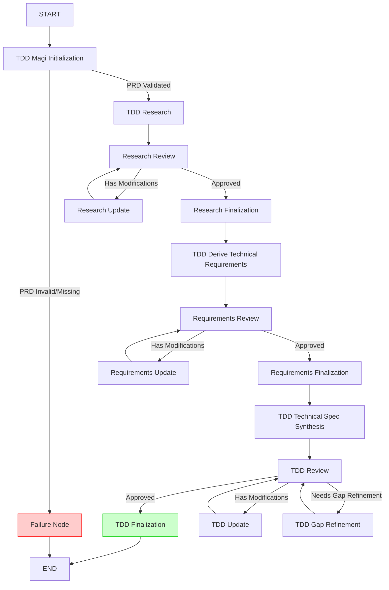

# TDD Generation Workflow Graph

## Overview

This document defines the graph flow for the Technical Design Document (TDD) Generation Workflow. The TDD workflow takes a finalized PRD (Product Requirements Document) and generates a comprehensive technical design document that specifies the "how" for implementing the requirements defined in the PRD.

## Workflow Diagram



## Flow Description

### Phase 1: Initialization and Validation
- **START** → **TDD Magi Initialization**
  - Validates `projectPath` and `featureId` are provided
  - Checks that PRD exists at `magi-sdd/<featureId>/prd.md`
  - Validates PRD status is "finalized"
  - Routes to Failure Node if PRD is invalid or missing
  - Routes to Research phase if validation succeeds

### Phase 2: Research and Approval

The research phase is critical to ensuring that we identify the right tools for the job when building out the feature. We cannot rely solely on the LLM being able to fully understand our entire codebase, it will scan and analyze, read docs but the human needs to be in the loop to guide it to ensure that it uses existing solutions and patterns instead of re-inventing the wheel. This is where the user might have a lot of input regarding examples the LLM should follow, guiding it to relevant sections of the codebase, etc.

- **TDD Research**
  - Analyzes project architecture and capabilities (project discovery)
    - Discovers available APIs, schemas, templates, and patterns already used in the application
    - Identifies similar features that can be used as guidance/examples
    - Documents existing conventions for components being built
  - Researches technical solutions that fit the project architecture (i.e. SDK capabilities, new integrations)
    - *NOTE*: this will eventually need to use whatever solution we come up for RAG to read through documentation
  - Identifies existing tools and strategies that can be used
  - Identifies what needs to be built vs. what can be reused
  - Documents solutions that will be employed to build the feature
  - **Writes artifact**: `research.md` with draft status
  
- **Research Review**
  - Presents research document for user review
  - Captures approval/modification decisions
  - Routes based on user decision:
    - **Approved** → Research Finalization
    - **Has Modifications** → Research Update (then loops back to Review)

- **Research Update**
  - Applies modifications requested during review
  - Updates `research.md` while maintaining structure
  - Routes back to Research Review

- **Research Finalization**
  - Updates `research.md` status from "draft" to "approved"
  - Proceeds to Technical Requirements Derivation phase

### Phase 3: Technical Requirements Derivation and Approval
- **TDD Derive Technical Requirements**
  - Reads finalized PRD
  - Reads approved `research.md`
  - Derives technical functional requirements (TFRs) from PRD functional requirements
  - Ensures **every TFR maps back to at least one PRD FR** (no scope creep)
  - Creates initial requirements document
  - **Writes artifact**: `requirements.md` with draft status

- **Requirements Review**
  - Presents requirements document for user review
  - Captures approval/modification decisions
  - Routes based on user decision:
    - **Approved** → Requirements Finalization
    - **Has Modifications** → Requirements Update (then loops back to Review)

- **Requirements Update**
  - Applies modifications requested during review
  - Updates `requirements.md` while maintaining traceability
  - Routes back to Requirements Review

- **Requirements Finalization**
  - Updates `requirements.md` status from "draft" to "approved"
  - Proceeds to Technical Spec Synthesis phase

### Phase 4: Technical Specification Synthesis
- **TDD Technical Spec Synthesis**
  - Reads approved `research.md` and `requirements.md`
  - Creates initial TDD document with draft status
  - Populates technical specification sections
    - *NOTE*: this is another area where the consumer might want to have influence as to _what_ gets included in the TDD
  - Seeds traceability table
  - **Writes artifact**: `tdd.md` with draft status

### Phase 5: TDD Review and Finalization
- **TDD Review**
  - Presents TDD for user review
  - Uses visual format for clarifying questions
  - Asks targeted, one-at-a-time questions to resolve ambiguities
  - Maintains Open Questions section
  - Captures approval/modification decisions
  - Routes based on user decision:
    - **Approved** → TDD Finalization
    - **Has Modifications** → TDD Update (then loops back to Review)
    - **Needs Gap Refinement** → TDD Gap Refinement (then loops back to Review)

- **TDD Update**
  - Applies modifications requested during review
  - Updates `tdd.md` while maintaining traceability
  - Preserves all checklist items and mappings
  - Routes back to TDD Review

- **TDD Gap Refinement**
  - Performs additional gap analysis on technical requirements
  - Identifies missing technical details or conflicts
  - Proposes TFR/NFR adjustments within PRD scope
  - Routes back to TDD Review

- **TDD Finalization**
  - Updates `tdd.md` status from "draft" to "finalized"
  - Requires explicit user approval (cannot auto-finalize)
  - Verifies all checklist items are complete
  - Ensures traceability is maintained
  - Updates traceability table in `prd.md` file to include TFR IDs, ensuring consistency between PRD and TDD
  - Routes to END

### Error Handling
- **Failure Node**
  - Handles non-recoverable errors (invalid PRD, missing files, etc.)
  - Communicates errors to user
  - Terminates workflow

## Intermediate Artifacts

The TDD workflow generates two intermediate artifacts that must be approved before proceeding to the next phase:

### 1. Technical Research (`research.md`)
- **Generated by**: `TDDResearchNode`
- **Purpose**: Documents project discovery (where the feature fits into the existing project, similar features that can be used as guidance/examples, existing conventions), tools and existing strategies that can be used, existing APIs that can be leveraged, what needs to be built vs. reused, and solutions that will be employed to build the feature
- **Status Flow**: `draft` → `approved` (via Research Review → Finalization)
- **Location**: `magi-sdd/<featureId>/research.md`
- **Used by**: Technical Requirements Derivation phase

### 2. Technical Requirements (`requirements.md`)
- **Generated by**: `TDDDeriveTechnicalRequirementsNode`
- **Purpose**: Documents technical functional requirements (TFRs) derived from PRD functional requirements, ensuring traceability back to PRD FRs
- **Status Flow**: `draft` → `approved` (via Requirements Review → Finalization)
- **Location**: `magi-sdd/<featureId>/requirements.md`
- **Used by**: Technical Spec Synthesis phase

### 3. Technical Design Document (`tdd.md`)
- **Generated by**: `TDDTechnicalSpecSynthesisNode`
- **Purpose**: Comprehensive technical design document that combines all approved artifacts into a complete specification
- **Status Flow**: `draft` → `finalized` (via TDD Review → Finalization)
- **Location**: `magi-sdd/<featureId>/tdd.md`
- **Output**: Finalized TDD ready for implementation task generation

- **Requirement**: Explicit user approval required
- **Verification**: All checklist items must be complete
- **Traceability**: All TFRs must map to PRD FRs
- **PRD Update**: Traceability table in `prd.md` must be updated with TFR IDs during finalization

## Traceability Requirements

- **Every TFR must map to ≥1 PRD FR**: Enforced during derivation and updates
- **Traceability table**: Maintained in TDD document
- **PRD Traceability table**: Updated in `prd.md` during TDD finalization to include TFR IDs, ensuring bidirectional traceability between PRD and TDD
- **No scope creep**: Updates must maintain PRD alignment

## Workflow State Definition

The TDD workflow state is defined using LangGraph's `Annotation` API, following the same pattern as the PRD workflow. The state manages all intermediate artifacts, review decisions, and workflow control.

### State Structure

```typescript
/*
 * Copyright (c) 2025, salesforce.com, inc.
 * All rights reserved.
 * SPDX-License-Identifier: MIT
 * For full license text, see the LICENSE file in the repo root or https://opensource.org/licenses/MIT
 */

import { Annotation } from '@langchain/langgraph';

/**
 * Standalone TDD Generation Workflow State
 *
 * This state is completely separate from the main mobile native workflow state
 * and focuses specifically on TDD generation activities.
 */
export const TDDGenerationWorkflowState = Annotation.Root({
  // Core TDD workflow data
  userInput: Annotation<Record<string, unknown>>,
  projectPath: Annotation<string>,
  featureId: Annotation<string>,

  // Research Review state
  isResearchApproved: Annotation<boolean>,
  researchModifications: Annotation<
    Array<{
      section: string;
      modificationRequest: string;
    }>
  >,

  // Requirements Review state
  isRequirementsApproved: Annotation<boolean>,
  requirementsModifications: Annotation<
    Array<{
      section: string;
      modificationRequest: string;
    }>
  >,

  // Gap Refinement state
  gapRefinementScore: Annotation<number>,
  identifiedTechnicalGaps: Annotation<
    Array<{
      id: string;
      title: string;
      description: string;
      severity: 'critical' | 'high' | 'medium' | 'low';
      category: string;
      impact: string;
      suggestedTFRs: Array<{
        title: string;
        description: string;
        category: 'FR-SYS' | 'FR-UI' | 'FR-INFRA' | 'FR-COMP';
      }>;
    }>
  >,

  // Iteration Control state
  userIterationPreference: Annotation<boolean>,

  // TDD Review state
  isTddApproved: Annotation<boolean>,
  tddModifications: Annotation<
    Array<{
      section: string;
      modificationRequest: string;
    }>
  >,

  // Error Handling state
  tddWorkflowFatalErrorMessages: Annotation<string[]>,
});

export type TDDState = typeof TDDGenerationWorkflowState.State;
```